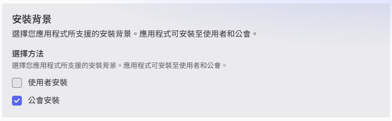
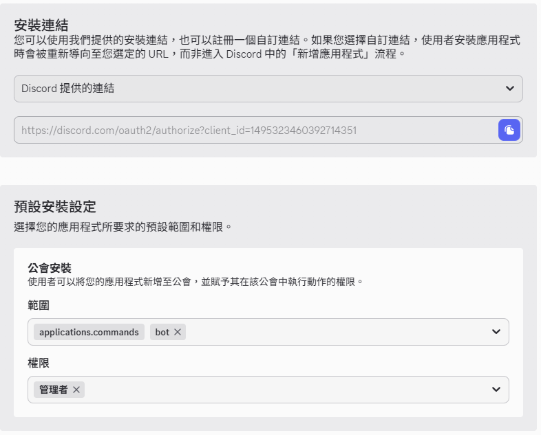
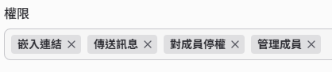
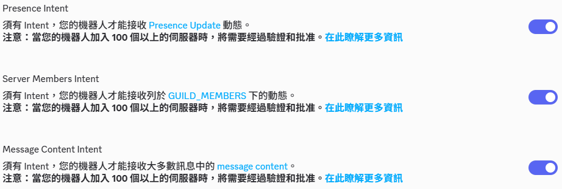
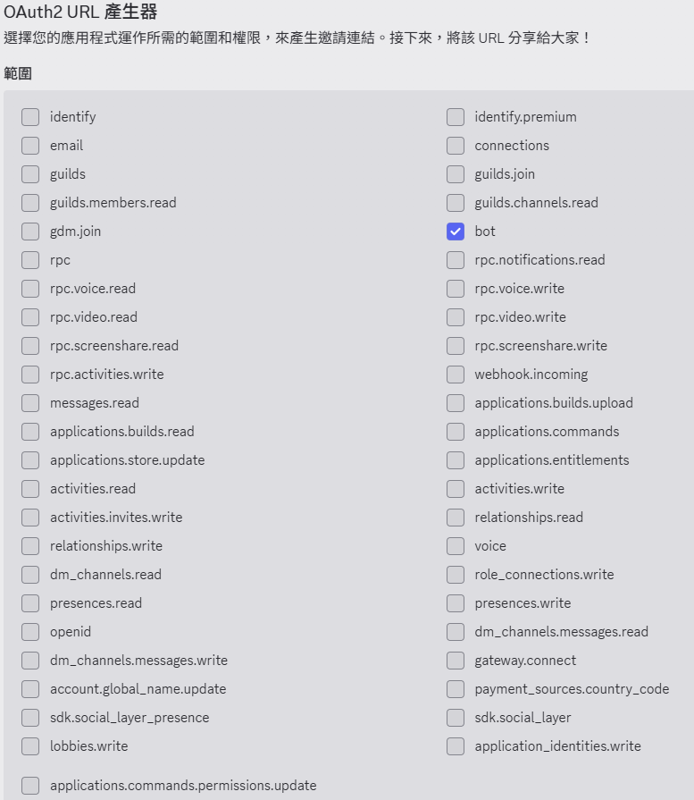
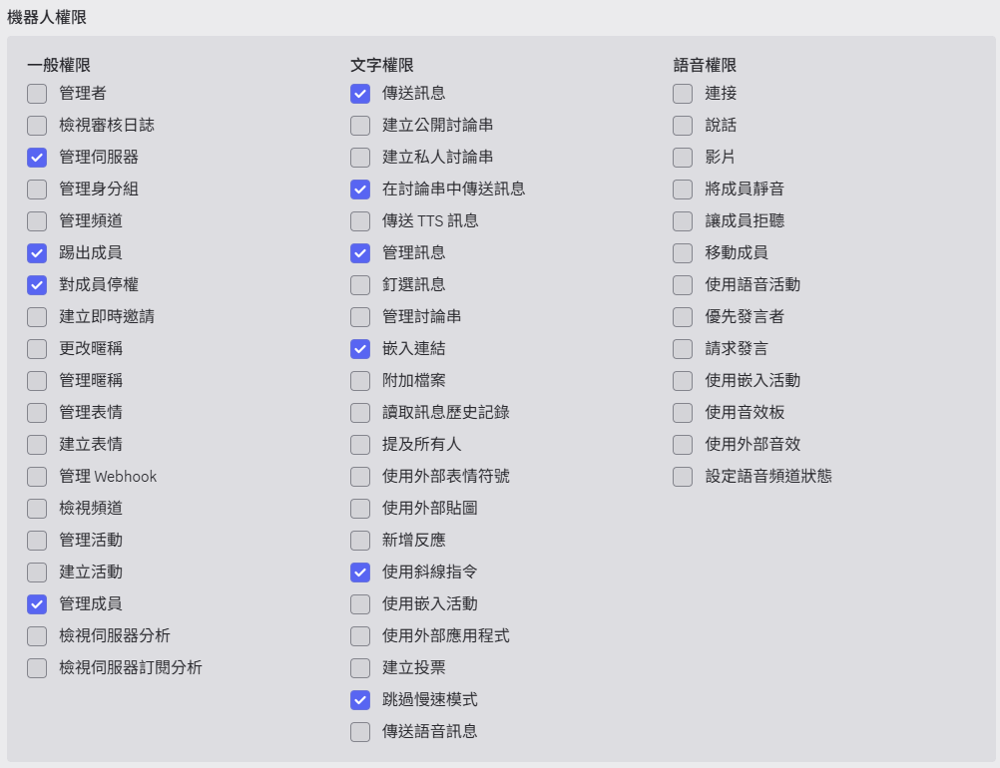
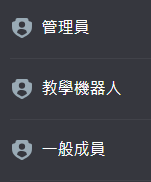
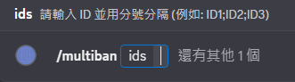

# Discord 批次封鎖機器人 (Batch-Ban Bot) 架設指南

本專案是一個基於 Python `discord.py` 開發的工具，旨在幫助伺服器管理員透過「斜線指令 (Slash Command)」快速封鎖多位違規使用者。本專案採用虛擬環境 (venv) 與環境變數 (.env) 技術，兼顧開發隔離性與密鑰安全性。

## 快速開始：下載與安裝 (Windows 使用者)

1. 前往 [Releases](https://github.com/Amano-xiv/Discord-Bot-Batch-Ban/releases/latest) 下載最新版本的 DiscordBatchBanBot.exe。
2. **解壓縮全部檔案**到一個資料夾中（請勿直接在壓縮視窗內執行）。
3. 找到資料夾內的 `.env` 檔案，按右鍵選擇「記事本」開啟。
4. 在 `DISCORD_TOKEN=` 後面貼上您的 Token 並儲存。
5. 執行 `DiscordBatchBanBot.exe`。

## 如果是下載執行檔可以忽略自行建置、準備工具、第二、三階段  

## 自行建置（下載DiscordBatchBanBot.exe可忽略）

您可以從 [Releases 頁面](https://github.com/Amano-xiv/Discord-Bot-Batch-Ban/releases/latest) 下載最新的專案檔。

## 準備工具（下載DiscordBatchBanBot.exe可忽略）

在開始架設前，請確認您的電腦已安裝以下工具：

* **Python 3.8+**: [官方下載點](https://www.python.org/downloads/)
* **程式碼編輯器**: 推薦使用 [VS Code](https://code.visualstudio.com/) （可不裝）
* **Discord 帳號**: 需具備伺服器的「管理員」或「封鎖成員」權限
* **終端機 (Terminal)**: 如 CMD、PowerShell 或 macOS Terminal （一般人電腦都有）

---

## 第一階段：Discord 開發者後台設定

1. **建立應用程式**: 前往 [Discord Developer Portal](https://discord.com/developers/applications)，點擊 `新建應用程式` 並命名。  
	  

2. 點選安裝分頁，設定安裝方法  
	  
	  
	※需注意提供的權限，如果要正常運作最少要有這些權限  
	  

3. **取得 Bot Token**:
	* 進入左側 `機器人` 頁面。
	* 點擊 `重設權杖` 取得金鑰 Token（第一次需要重設，切勿外流）  
	  
	先複製起來以避免之後找不到，或是用記事本打開資料夾內的 .env.example 檔案。  
	貼上到 `DISCORD_TOKEN=` 之後，並且將檔案名稱改名成 .env 移除副檔名。  
	如果是使用執行檔，直接貼入 .env 中即可。

4. **開啟特權權限 (Intents)**:
	  
	※理論上有一些細節需要注意，但本次案例先不管，有需要再去了解。

5. **產生邀請連結**:
	* 進入 `OAuth2` 。  
	* 使用 OAuth2 URL 產生器。  
	* 勾選 `bot` 與 `applications.commands`。  
	
	* 勾選這些選項，如果不想細分權限，可以只勾最大權限的管理者。  
	
	* 整合類型選擇 `公會安裝` 。
	* 複製產生的連結在瀏覽器開啟。
	* 邀請機器人進入伺服器。

6. **確認權限**
	要注意機器人的身份組權限需要高於，要被停權的成員身份組。  
	建議設定只低於管理員  
	

---

## 第二階段：建立環境與安裝（下載DiscordBatchBanBot.exe可忽略）

請在終端機執行以下指令：

1. 建立並進入專案資料夾
	* 在專案資料夾中開啟終端機
	* 如果不知道如何進入，可以使用 Win+R 輸入 cmd 開啟終端
	* 使用指令進入資料夾
	```bash
	cd {你的資料夾位置}
	```

2. 建立虛擬環境 (venv)
	```bash
	python -m venv venv
	```

3. 啟動虛擬環境
	```bash
	# Windows:
	.\venv\Scripts\activate
	# macOS/Linux:
	source venv/bin/activate
	```

4. 安裝必要套件
	```bash
	pip install discord.py python-dotenv
	```

---

## 第三階段：檔案配置（下載DiscordBatchBanBot.exe可忽略）

1. .env (金鑰)  
	```Plaintext
	DISCORD_TOKEN=在此貼上你的機器人TOKEN
	```

2. 啟動機器人  
	確保在 venv 的環境下執行  
	```bash
	python bot.py
	```
	若執行成功會看到提示訊息  
	```Plaintext
	機器人已上線： {你設定的名稱}
	```

---

## 完成
設定好後，在Discord聊天頻道輸入 `/multiban` 就可以開始執行停權流程。  


## 注意事項
* 有幾種狀況會導致失敗  
1. 權限不足
	* 權限排序設定或給予的權限不夠。
2. 指令未顯示
	* 斜線指令同步可能需要一段時間，可以嘗試使用 ctrl+ R 重新載入Discord。
